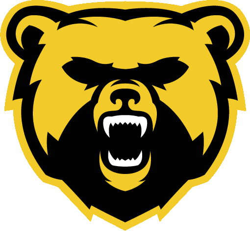

# Refonte de contenu - Andenne Bears

Date d'extraction : 24 avril 2026  
Source analysee : https://www.andenne-bears.be/

## 1. Extraction du front-end existant

### Contenu visible

- Logo : `images/logoBears.png`
- Texte alternatif du logo : `Logo des Bears d'Andenne`
- Titre principal : `Andenne Bears`
- Sous-titre : `American & Flag Football Team`
- Liens :
  - Facebook : https://www.facebook.com/andennebears
  - Instagram : https://www.instagram.com/andennebears/
  - E-mail : comite@andenne-bears.be
- Copyright : `Copyright © 2024 - Andenne Bears ASBL`

### Contenu SEO et social

- Titre HTML : `Andenne Bears - American & Flag Football Team @ Andenne`
- Meta description :
  `Rejoignez les Bears d'Andenne, équipe de football américain et flag football amateur à Andenne, active depuis 2002. Découvrez nos événements et opportunités de recrutement. One team. One family. One heartbeat.`
- Meta keywords :
  `football américain, Namur County Andenne Bears, Andenne, recrutement, événements, sport amateur, football américain Belgique, Namur`
- Open Graph title :
  `Andenne Bears - Football Américain et flag football à Andenne (province de Namur)`
- Open Graph description :
  `Découvrez l'équipe de football américain amateur 'Andenne Bears', recrutez des joueurs et participez à nos événements. One team. One family. One heartbeat.`
- Open Graph image : `images/logoBears.png`
- Open Graph URL actuel : `https://tonsite.com`
- Robots : `index, follow`

### Structure HTML actuelle

```html
<!DOCTYPE html>
<html>
  <head>
    <meta charset="utf-8" />
    <link rel="stylesheet" href="bears.css" />
    <link rel="shortcut icon" href="images/favicon.png" />
    <title>Andenne Bears - American & Flag Football Team @ Andenne</title>
    <meta
      name="description"
      content="Rejoignez les Bears d'Andenne, équipe de football américain et flag football amateur à Andenne, active depuis 2002. Découvrez nos événements et opportunités de recrutement. One team. One family. One heartbeat."
    />
    <meta
      name="keywords"
      content="football américain, Namur County Andenne Bears, Andenne, recrutement, événements, sport amateur, football américain Belgique, Namur"
    />
    <meta
      property="og:title"
      content="Andenne Bears - Football Américain et flag football à Andenne (province de Namur)"
    />
    <meta
      property="og:description"
      content="Découvrez l'équipe de football américain amateur 'Andenne Bears', recrutez des joueurs et participez à nos événements. One team. One family. One heartbeat."
    />
    <meta property="og:image" content="images/logoBears.png" />
    <meta property="og:url" content="https://tonsite.com" />
    <meta property="og:type" content="website" />
    <meta name="robots" content="index, follow" />
  </head>
  <body>
    
    <h1>Andenne Bears</h1>
    <h2>American & Flag Football Team</h2>
    <br />
    <div class="backgroundColorTxt">
      <a href="https://www.facebook.com/andennebears">Facebook</a> -
      <a href="https://www.instagram.com/andennebears/">Instagram</a> -
      <a href="mailto:comite@andenne-bears.be">Envoyez-nous un mail</a>
      <p>Copyright © 2024 - Andenne Bears ASBL</p>
    </div>
  </body>
</html>
```

### Structure CSS actuelle

```css
@font-face {
    font-family: 'BertholdCityBold';
    src: url('fonts/BertholdCityBold.ttf');
}
@font-face {
    font-family: 'BertholdCityMedium';
    src: url('fonts/BertholdCityMedium.ttf');
}

body{
    background: url("images/background.jpg") no-repeat center fixed;
    text-align: center;
    padding-top: 3em;
}

h1{
    text-align:center;
    font-size: 4em;
    color: #ffffff;
    font-family: 'BertholdCityBold', 'BertholdCityMedium', "SF Pro Text","Helvetica Neue","Helvetica","Arial",sans-serif;
}

h2{
    text-align:center;
    font-size: 2.2em;
    color: #ffffff;
    font-family: 'BertholdCityBold', 'BertholdCityMedium', "SF Pro Text","Helvetica Neue","Helvetica","Arial",sans-serif;
}

h3{
    text-align:center;
    font-size: 1.4em;
    color: rgba(0,0,0,1);
}

p, ul, a{
    text-align:center;
    color: #ffffff;
    font-size: 1em;
    font-family: "SF Pro Text","Helvetica Neue","Helvetica","Arial",sans-serif;
}

a{
    font-size: 1em;
    font-family: "SF Pro Text","Helvetica Neue","Helvetica","Arial",sans-serif;
    text-decoration: none;
    color: #f2cb2a;
}
a:hover{
    text-decoration: underline;
    color: rgba(255,255,255,1);
}

.backgroundColorTxt{
    position: fixed;
    width: 100%;
    bottom: 0;
    left: 0;
    background-color: black;
    padding: 2em 0;
}
```

## 2. Diagnostic rapide

Le site actuel fonctionne comme une carte de visite. Il communique le nom, le sport, le logo et les points de contact, mais il ne repond pas encore aux questions naturelles d'un visiteur : qui peut rejoindre, quand venir essayer, ou s'entrainer, combien cela coute, comment soutenir le club, quelles sont les categories, et quelle est l'ambiance.

Les meilleurs elements deja presents sont le nom fort, le logo, la promesse sportive claire, les reseaux sociaux, l'adresse e-mail, la localisation implicite a Andenne, l'historique depuis 2002 et la devise `One team. One family. One heartbeat.`. La refonte doit garder cette base et la transformer en parcours d'action.

Points a corriger en priorite :

- Remplacer `https://tonsite.com` par l'URL canonique `https://www.andenne-bears.be/`.
- Ajouter une navigation claire.
- Ajouter des appels a l'action visibles : essai gratuit, rejoindre, contacter, sponsoriser.
- Clarifier les publics : football americain, flag football, jeunes, adultes, debutants, parents, partenaires.
- Ajouter des informations pratiques : lieu, horaires, saison, equipement requis, cotisation ou procedure de contact.
- Rendre la page utile sans dependance aux seuls reseaux sociaux.
- Prevoir des contenus faciles a maintenir par le club.

## 3. Informations publiques externes a exploiter

Ces elements proviennent de sources publiques trouvees hors du site actuel. Ils enrichissent fortement la refonte, mais doivent etre valides par le club avant publication, car certaines informations se contredisent selon les sources ou peuvent avoir change.

### Sources consultees

- Annuaire de la Ville d'Andenne : https://annuaire.andenne.be/poi/andenne-bears/
- Ligue Francophone de Football Americain : https://lffa.be/team/andenne-bears/
- Wikipedia : https://fr.wikipedia.org/wiki/Andenne_Bears
- Regie Sportive Communale Andennaise : https://www.andennesports.be/fr/nos-clubs-partenaires

### Informations pratiques candidates

- Sports proposes :
  - Football americain tackle.
  - Flag football, version sans contact.
- Public cible indique par la Regie Sportive Communale Andennaise :
  - Flag Football a partir de 8 ans.
  - Football americain a partir de 14 ans.
  - Pratique mixte.
- Categories mentionnees par l'annuaire de la Ville d'Andenne :
  - Flag football U13.
  - Flag football U16.
  - Flag football seniors.
  - Football americain.
- Cotisations indiquees par l'annuaire de la Ville d'Andenne :
  - Football americain : 260 EUR/an.
  - Flag football : 200 EUR/an.
  - Assurances et affiliations a la ligue comprises.
- E-mail confirme :
  - `comite@andenne-bears.be`
- Facebook confirme :
  - https://www.facebook.com/andennebears
- Instagram confirme depuis le site actuel :
  - https://www.instagram.com/andennebears/

### Horaires et lieux a confirmer

Deux sources publiques donnent des informations differentes. La refonte doit donc prevoir une zone facile a mettre a jour et demander confirmation au club avant mise en ligne.

Annuaire de la Ville d'Andenne :

- Entrainements combines a l'Andenne Arena.
- Mardi de 18h30 a 20h.
- Samedi de 10h a 12h.
- Adresse affichee : Rue de Halbosart, 25, 5300 Seilles.

LFFA :

- Site d'entrainement en renovation.
- Entrainements temporairement sur le terrain d'Evelette-Jallet, rue du Tige, Ohey, jusqu'a la fin des travaux.
- Tackle : mercredi et vendredi de 19h30 a 21h30.
- Flag football : mardi de 18h30 a 20h et samedi de 10h a 12h.
- Adresse principale affichee : Rue Dr Melin 14, 5300 Andenne.

Wikipedia :

- Stade mentionne : Rue Docteur Melin, 14 a 5300 Andenne.
- Siege mentionne : Place des Tilleuls, 39 a 5300 Andenne.

Decision recommandee :

- Demander au comite une version officielle des lieux et horaires.
- Afficher une alerte temporaire si le site d'entrainement est encore en renovation.
- Structurer le contenu en `Tackle`, `Flag football`, `Essai`, `Lieu temporaire`, `Lieu habituel`.

### Histoire et identite candidates

- Club fonde en 2002.
- Ancien nom mentionne par Wikipedia : Andenne Grizzly.
- Nom officiel mentionne par Wikipedia : Namur Country Andenne Bears. A confirmer, car le site actuel utilise `Andenne Bears` et les metadonnees parlent de `Namur County Andenne Bears`.
- Seul club de football americain de la province de Namur, selon Wikipedia.
- Champion de Division 2 en 2015, selon Wikipedia.
- Membre de la LFFA.
- Valeurs reprises par la LFFA : combativite, respect, solidarite, ambiance familiale.

### Opportunites de contenu issues des sources externes

- Creer une section `Nos disciplines` avec explication claire du tackle et du flag.
- Creer une section `Pour qui ?` avec ages, niveaux et mixite.
- Creer une section `Horaires et lieux` administrable facilement.
- Creer une section `Tarifs` ou `Cotisations`, seulement apres validation du comite.
- Creer une section `Histoire du club` autour de 2002, Andenne, LFFA et province de Namur.
- Creer une section `Actualite terrain` pour gerer les renovations ou changements temporaires de lieu.

## 4. Equipe de refonte de contenu

### Direction sportive

Objectif : recruter sans promettre n'importe quoi. Le site doit dire que les debutants sont bienvenus, que le club encadre les nouveaux, et que l'engagement attendu est clair.

Contenus demandes :

- Categories disponibles : seniors, flag, juniors si applicable.
- Horaires et lieux d'entrainement.
- Conditions pour venir tester.
- Materiel necessaire pour une premiere seance.
- Message rassurant : pas besoin d'experience, mais envie d'apprendre et esprit d'equipe indispensables.

### Responsable recrutement

Objectif : transformer les curieux en inscriptions ou demandes de contact.

Contenus demandes :

- Bouton principal : `Venir essayer`
- Bouton secondaire : `Nous contacter`
- Mini formulaire recommande : nom, age, commune, sport souhaite, experience, telephone/e-mail.
- Page ou section `Rejoindre les Bears`.
- FAQ courte : age minimum, niveau requis, prix, equipement, assurance, entrainements.

### Joueurs et joueuses

Objectif : montrer l'ambiance et la realite du club.

Contenus demandes :

- Photos de groupe, entrainement, match, flag football, vestiaire, benevoles.
- Courtes citations de membres.
- Mise en avant de la devise : `One team. One family. One heartbeat.`
- Ton direct, chaleureux, sportif.

### Parents et jeunes

Objectif : rassurer sur l'encadrement, la securite et le cadre.

Contenus demandes :

- Explication simple du flag football.
- Encadrement, respect, progression, securite.
- Infos pratiques pour venir voir ou tester.
- Contact specifique pour questions parents.

### Partenaires et sponsors

Objectif : ouvrir une porte commerciale claire.

Contenus demandes :

- Section `Devenir partenaire`.
- Valeur locale : visibilite, communaute, sport amateur, jeunesse, engagement andennais.
- Formats possibles : sponsor maillot, evenement, materiel, soutien logistique, partenariat local.
- Contact direct : `comite@andenne-bears.be`.

### Communication et SEO

Objectif : rendre le site trouvable et partageable.

Contenus demandes :

- Titre recommande : `Andenne Bears - Football américain et flag football à Andenne`
- Meta description recommandee :
  `Rejoignez les Andenne Bears, club de football américain et de flag football à Andenne. Entrainements, essais, recrutement, événements et partenaires en province de Namur.`
- Mots-cles naturels a integrer dans les textes : football americain Andenne, flag football Andenne, club sportif Andenne, sport amateur Namur, football americain Belgique.
- Schema local a envisager : club sportif / organisation locale.

## 5. Proposition de nouvelle architecture

### Page d'accueil

Objectif : faire comprendre en 5 secondes qui sont les Bears et quoi faire ensuite.

Contenus :

- Hero avec logo, nom, photo reelle de l'equipe ou action de jeu.
- H1 : `Andenne Bears`
- Sous-titre : `Football américain et flag football à Andenne`
- Phrase courte :
  `Depuis 2002, les Bears rassemblent joueurs, joueuses, coachs et bénévoles autour d'un même terrain : progresser ensemble.`
- CTA principal : `Venir essayer`
- CTA secondaire : `Suivre le club`

### Section Rejoindre

Objectif : convertir.

Contenus :

- `Débutant ou confirmé, viens tester un entrainement avec les Bears.`
- Informations pratiques : age, niveau, materiel, contact, disciplines, cotisation si validee.
- Bouton : `Demander un essai`

### Section Equipes

Objectif : orienter selon le profil.

Contenus a prevoir :

- Football americain tackle.
- Flag football.
- Jeunes ou categories, si le club les propose.
- Coaching staff, si disponible.

### Section Calendrier

Objectif : donner de la vie au site.

Contenus :

- Prochains entrainements publics.
- Matchs.
- Evenements club.
- Recrutement.
- Liens vers Facebook/Instagram pour les actualites rapides.

### Section Club

Objectif : raconter l'identite.

Contenus :

- Fondation en 2002.
- Valeurs : equipe, famille, engagement, respect, intensite.
- Devise : `One team. One family. One heartbeat.`
- ASBL, benevoles, ancrage local.

### Section Partenaires

Objectif : faciliter le sponsoring.

Contenus :

- Pourquoi soutenir les Bears.
- Logos partenaires.
- Formules ou demande de dossier.
- Contact.

### Section Contact

Objectif : rendre l'action immediate.

Contenus :

- E-mail : `comite@andenne-bears.be`
- Facebook : https://www.facebook.com/andennebears
- Instagram : https://www.instagram.com/andennebears/
- Formulaire.
- Carte ou adresse du terrain, a confirmer par le club.

### Section Infos pratiques

Objectif : eviter que les visiteurs doivent chercher les informations sur Facebook.

Contenus :

- Horaires tackle.
- Horaires flag football.
- Lieu habituel.
- Lieu temporaire si travaux.
- Age minimum par discipline.
- Cotisations si confirmees.
- Ce qu'il faut apporter pour un premier essai.

## 6. Ton editorial recommande

Le ton doit etre sportif, local, accessible et fier. Le football americain peut impressionner les debutants : le site doit donc etre intense dans l'identite, mais tres simple dans l'accueil.

Exemples de formulations :

- `Viens essayer. On t'apprend le reste.`
- `Que tu connaisses deja le jeu ou que tu partes de zero, il y a une place pour toi sur le terrain.`
- `Les Bears, c'est un club, une equipe et une famille de terrain.`
- `Jouer, coacher, aider, sponsoriser : chacun peut faire avancer le club.`

## 7. Brief pour les deux web designers

### Objectif commun

Transformer la carte de visite actuelle en site vitrine complet pour un club de football americain amateur : clair pour les nouveaux joueurs, rassurant pour les parents, utile pour les partenaires et vivant pour la communaute.

Le site doit rester simple a maintenir. Il ne doit pas devenir un magazine complexe si le club n'a pas l'equipe pour le mettre a jour.

### Designer 1 - UX, parcours et structure

Responsabilites :

- Definir l'arborescence finale.
- Concevoir les parcours `Venir essayer`, `Contacter`, `Devenir partenaire`.
- Proposer la structure mobile en priorite.
- Prevoir les etats vides pour calendrier ou actualites.
- Concevoir une navigation courte : Accueil, Rejoindre, Equipes, Calendrier, Partenaires, Contact.

Livrables :

- Wireframes mobile et desktop.
- Parcours utilisateur pour joueur, parent et sponsor.
- Liste des composants necessaires.
- Recommandations de contenu manquant a demander au club.

### Designer 2 - Direction visuelle et UI

Responsabilites :

- Construire une identite web autour du logo existant.
- Utiliser une vraie photographie d'equipe ou de match comme signal principal.
- Definir palette, typographies, boutons, cartes, formulaires et etats interactifs.
- Garder l'energie sportive sans rendre l'interface agressive.
- Prevoir un systeme visuel coherent pour photos, actualites, partenaires et CTA.

Livrables :

- Maquette haute fidelite mobile et desktop.
- Mini design system : couleurs, typographies, boutons, liens, cards, formulaire.
- Style guide d'images : cadrage, contraste, usage du logo.
- Composants UI prets a transmettre au developpement.

### Travail en binome

Les deux designers doivent converger sur :

- Un hero qui montre immediatement le club.
- Une priorite claire au recrutement.
- Une experience mobile rapide.
- Une page qui reste informative meme sans actualites recentes.
- Des CTA visibles mais pas envahissants.
- Une accessibilite correcte : contrastes, tailles de texte, libelles de formulaire, navigation clavier.

## 8. Contenus a demander au club avant design final

- Adresse exacte du terrain ou lieu d'entrainement.
- Horaires actuels.
- Categories actives.
- Age minimum.
- Conditions d'essai.
- Cotisation ou fourchette indicative, si communicable.
- Confirmation des informations publiees par la Ville d'Andenne et la LFFA.
- Confirmation du lieu temporaire eventuel a Evelette-Jallet / Ohey.
- Confirmation du lieu habituel : Andenne Arena, Rue de Halbosart, ou Rue Dr Melin.
- Photos recentes en haute qualite.
- Logos partenaires.
- Nom des coachs ou contacts publics.
- Calendrier saison ou prochains evenements.
- Confirmation de l'appellation officielle : `Andenne Bears` ou `Namur County Andenne Bears`.

## 9. Version courte de contenu pret a maquettter

### Hero

`Andenne Bears`

`Football américain et flag football à Andenne`

`Depuis 2002, les Bears rassemblent joueurs, joueuses, coachs et bénévoles autour d'un même esprit : One team. One family. One heartbeat.`

Boutons :

- `Venir essayer`
- `Contacter le club`

### Rejoindre

`Tu veux decouvrir le football americain ou le flag football ? Viens tester un entrainement avec les Bears. Debutant ou confirme, tu seras accueilli par le staff et l'equipe.`

`Flag football des 8 ans, football americain des 14 ans : les informations exactes sont a confirmer par le club avant publication.`

### Club

`Ancrés à Andenne depuis 2002, les Bears sont un club amateur porte par l'engagement, le respect et l'esprit d'equipe. Sur le terrain comme en dehors, chacun contribue a faire vivre le club.`

### Partenaires

`Soutenir les Bears, c'est soutenir un club local, des benevoles, des jeunes sportifs et une communaute active en province de Namur.`

### Contact

`Une question, un essai, un partenariat ? Contactez le comité des Andenne Bears.`

E-mail : `comite@andenne-bears.be`

## 10. Priorites de refonte

1. Corriger les metadonnees et l'URL Open Graph.
2. Ajouter une vraie page d'accueil structuree.
3. Ajouter un parcours de recrutement.
4. Ajouter les informations pratiques.
5. Integrer des photos reelles.
6. Ajouter une section partenaires.
7. Prevoir une base maintenable pour calendrier ou actualites.
